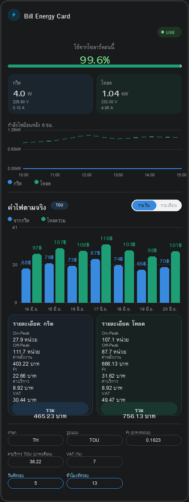
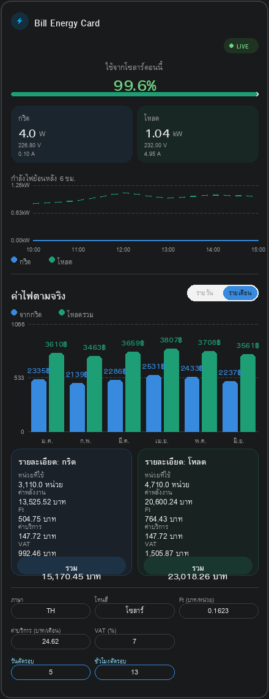

# Bill Energy Card

Custom Lovelace card สำหรับ Home Assistant ที่เปรียบเทียบพลังงานและค่าไฟฟ้าจาก **2 แหล่ง** (เช่น พลังงานที่ดึงจากกริด vs พลังงานที่ใช้งานจริงทั้งบ้าน) ในการ์ดเดียว เหมาะมากสำหรับบ้านที่มีระบบ **โซลาร์ + แบตเตอรี่** เพราะจะเห็นชัดว่าระบบโซลาร์ช่วยประหยัดค่าไฟไปได้เท่าไหร่ในแต่ละวัน/รอบบิล

> ⚠️ **v2.0.0 เป็น breaking change** — เปลี่ยนวิธีอ่านข้อมูลทั้งหมด ถ้าอัปเดตจาก v1.x ต้องตั้งค่า entity ใหม่ทั้งหมด อ่านหัวข้อ [สถาปัตยกรรม](#สถาปัตยกรรม-สำคัญ-อ่านก่อนติดตั้ง) ก่อนติดตั้ง

## คุณสมบัติ

- เปรียบเทียบพลังงานจากกริด vs โหลดรวมในการ์ดเดียว แทนการแยกการ์ด
- คำนวณค่าไฟอัตโนมัติตามโครงสร้างอัตรา PEA: tier 1/2/3 + Ft adjustment + ค่าบริการ + VAT — **ทุกค่าปรับตั้งได้** เพราะค่า Ft เปลี่ยนทุก 4 เดือน
- **รอบบิลตัดตรงเวลาจริงที่คุณกำหนด** (ไม่ใช่ปฏิทินเดือน) โดยตรวจจับจากค่าที่ sensor ของคุณ reset เอง — แม่นยำได้ถึงระดับชั่วโมง
- สลับมุมมอง **รายวัน / รายเดือน** ได้ในตัวการ์ดทันที
- กราฟแท่งเปรียบเทียบ พร้อม**ตัวเลขค่าไฟ (฿) แสดงเหนือแต่ละแท่งโดยตรง** ขนาดใหญ่ชัดเจน อ่านง่ายแม้เปิดจากมือถือ
- คำนวณ **"ประหยัดได้จากโซลาร์"** อัตโนมัติจากส่วนต่างค่าไฟกริด vs โหลด
- **เลือกภาษาได้ทั้งไทย/อังกฤษ** สลับได้จากปุ่มบนตัวการ์ดเองหรือในหน้าตั้งค่า ข้อความทั้งการ์ดเปลี่ยนตามทันที
- หน้าตาแบบ **Modern** — ไอคอนอยู่ในวงกลม badge สี, กล่องสรุป/รายละเอียดเป็นพื้นสีพาสเทล **อิงจากสี palette ที่เลือกไว้จริง**, ปุ่ม/ช่องตั้งค่าเป็นแคปซูล ใช้ได้ทั้งธีมสว่างและธีมมืดของ Home Assistant
- เลือกพาเลตสีได้ 4 แบบ: **Solar** (ฟ้า-เขียว, ค่าเริ่มต้น) / **Modern** (เขียวมรกต) / **PEA** (ม่วง-ทอง) / **กำหนดเอง** (เลือกสีกริด/โหลดเองได้ผ่าน Visual Editor)
- ออกแบบ layout ให้อ่านง่ายบนจอมือถือ (label/value แยกบรรทัดกันตัดคำกลางวลีภาษาไทย)
- มี **Visual Editor** ในตัว เลือก entity ผ่าน UI picker ได้เลย (พิมพ์ค้นหาเซ็นเซอร์ ไม่ต้องจำ/พิมพ์ entity_id เอง) ไม่ต้องเขียน YAML เอง

## ภาพตัวอย่าง

> รูปด้านล่างเป็น **mockup** จำลองหน้าตาการ์ด (ไม่ใช่สกรีนช็อตจาก Home Assistant จริง) ใช้เพื่อให้เห็นโครงหน้าตาก่อนติดตั้งจริง — แนะนำให้แคปหน้าจอจริงจาก HA มาแทนไฟล์เดิมในโฟลเดอร์ `screenshots/` เมื่อใช้งานแล้ว

**มุมมองรายวัน**


**มุมมองรายเดือน**


## สถาปัตยกรรม (สำคัญ อ่านก่อนติดตั้ง)

การ์ดนี้**ไม่ได้คำนวณรอบบิลเอง**จากปฏิทินหรือ statistics ของ Home Assistant อีกต่อไป — เพราะ statistics ของ HA เก็บข้อมูลเป็นก้อนรายวัน ไม่สามารถตัดรอบตรงเวลาจริงของมิเตอร์ PEA ได้ (ถ้าคุณรีเซ็ตรอบตอน 13:45 การ์ดจะไม่รู้)

วิธีใหม่: **คุณสร้าง sensor ที่ reset ค่าตัวเองตรงเวลาจริง** (ผ่าน Node-RED, automation, หรือ ESPHome) แล้วให้การ์ดอ่านค่าจาก sensor นั้นโดยตรง การ์ดจะตรวจจับ "รอบที่จบไปแล้ว" เองจากค่าที่ตกลงกะทันหันในประวัติของ sensor (ดูจาก Long-term Statistics ระดับชั่วโมง) — ไม่ต้องบอกการ์ดว่าตัดรอบวันไหน/เวลาไหนเลย

**ต้องมี sensor ทั้งหมด 4 ตัว** (เพราะรายวันกับรายเดือนรีเซ็ตคนละจังหวะ):

| Sensor | รีเซ็ตเมื่อไหร่ | ใช้กับมุมมอง |
|---|---|---|
| `grid_entity_daily` | ทุกเที่ยงคืน | รายวัน |
| `load_entity_daily` | ทุกเที่ยงคืน | รายวัน |
| `grid_entity_cycle` | ตรงเวลาที่ PEA ตัดรอบบิลจริง | รายเดือน |
| `load_entity_cycle` | ตรงเวลาที่ PEA ตัดรอบบิลจริง | รายเดือน |

แต่ละ sensor ควรเป็น `state_class: total_increasing` (ไล่ขึ้นตลอดจนกว่าจะถูกรีเซ็ตเป็น 0 — เหมือน utility_meter ของ HA) — ตัวอย่างการสร้างผ่าน Node-RED: ทำ flow ที่ trigger ตรงเวลาตัดรอบจริง อ่านค่ามิเตอร์ดิบ ณ ขณะนั้น บันทึกเป็นจุดอ้างอิง แล้วคำนวณ `ค่าปัจจุบัน − จุดอ้างอิงล่าสุด` ส่งกลับเป็น sensor ใน Home Assistant (เช่นผ่าน MQTT หรือ `input_number` + template sensor)

📋 **ไม่อยากเขียนโค้ด Node-RED?** ดู [`SETUP_GUIDE.md`](SETUP_GUIDE.md) — วิธีสร้างทั้ง 4 sensor ด้วย Utility Meter Helper + Automation ของ Home Assistant เองล้วนๆ ไม่ต้องเขียนโค้ดเลย (รองรับตั้งวัน+เวลาตัดรอบจริงผ่าน `input_number`)

### ความต้องการเบื้องต้น

- เปิดใช้ `recorder` ตามปกติของ Home Assistant (ค่าเริ่มต้นเปิดอยู่แล้ว) เพื่อให้มี long-term statistics ระดับชั่วโมงให้ดึง
- sensor ทั้ง 4 ตัวต้อง reset (ตกจาก ค่าสูง → 0 หรือใกล้ 0) อย่างน้อย **1 ครั้ง** ก่อน จึงจะมีรอบให้การ์ดแสดง — ถ้าเพิ่งตั้ง sensor ใหม่ต้องรอให้ผ่านรอบแรกก่อน
- ความละเอียดการตรวจจับรอบอยู่ที่ **ระดับชั่วโมง** (อิง LTS hourly statistics ซึ่งเก็บยาวระยะยาว ไม่ถูกล้างเหมือน raw history) ถ้ารีเซ็ตเวลาบ่ายๆ การ์ดจะรู้ว่าอยู่ใน "ชั่วโมงนั้น" แต่ไม่ละเอียดถึงระดับนาที

## การติดตั้ง

### วิธีที่ 1: HACS (Custom Repository)

1. HACS → เมนู `⋮` มุมขวาบน → **Custom repositories**
2. ใส่ URL: `https://github.com/jingjoks/Bill-Energy-Card`, Category: **Dashboard**
3. ค้นหา "Bill Energy Card" ในรายการ Frontend แล้วติดตั้ง
4. HACS จะเพิ่ม resource ให้อัตโนมัติ — รีเฟรชหน้าเบราว์เซอร์ (Ctrl+Shift+R)

### วิธีที่ 2: Manual

1. ดาวน์โหลด `bill-energy-card.js` ไปไว้ที่ `/config/www/`
2. เพิ่ม resource ใน **Settings → Dashboards → Resources**:
   ```yaml
   - url: /local/bill-energy-card.js
     type: module
   ```
3. รีเฟรชหน้าเบราว์เซอร์ (Ctrl+Shift+R)

## การใช้งาน

เพิ่มการ์ดผ่าน **Add Card → Bill Energy Card** (Visual Editor — เลือก sensor ทั้ง 4 ตัวผ่าน UI picker ได้เลย) หรือเขียน YAML ตรง:

```yaml
type: custom:bill-energy-card
grid_entity_daily: sensor.grid_energy_daily
load_entity_daily: sensor.load_energy_daily
grid_entity_cycle: sensor.grid_energy_cycle
load_entity_cycle: sensor.load_energy_cycle
```

ดูตัวอย่างเพิ่มเติมในโฟลเดอร์ [`examples/`](examples/)

## ตัวเลือกการตั้งค่า

| Key | ค่าเริ่มต้น | คำอธิบาย |
|---|---|---|
| `title` | `Bill Energy Card` | ชื่อหัวการ์ด |
| `language` | `th` | ภาษาที่แสดงในการ์ด: `th` หรือ `en` (สลับจากปุ่มบนตัวการ์ดเองก็ได้ ไม่ต้องแก้ YAML) |
| `grid_entity_daily` | *(ต้องระบุ)* | sensor พลังงานจากกริด ที่ reset ทุกเที่ยงคืน — ใช้กับมุมมองรายวัน |
| `load_entity_daily` | *(ต้องระบุ)* | sensor พลังงานโหลดรวม ที่ reset ทุกเที่ยงคืน — ใช้กับมุมมองรายวัน |
| `grid_entity_cycle` | *(ต้องระบุ)* | sensor พลังงานจากกริด ที่ reset ตรงเวลาตัดรอบบิลจริง — ใช้กับมุมมองรายเดือน |
| `load_entity_cycle` | *(ต้องระบุ)* | sensor พลังงานโหลดรวม ที่ reset ตรงเวลาตัดรอบบิลจริง — ใช้กับมุมมองรายเดือน |
| `ft_adjustment` | `0.1623` | ค่า Ft adjustment (บาท/หน่วย) — เปลี่ยนทุก 4 เดือนตามประกาศ กกพ. |
| `service_charge` | `24.62` | ค่าบริการ (บาท/เดือน) |
| `vat_percent` | `7` | อัตราภาษีมูลค่าเพิ่ม (%) |
| `tier1_rate` / `tier1_limit` | `3.2484` / `150` | อัตราค่าไฟและเพดานหน่วยขั้นที่ 1 |
| `tier2_rate` / `tier2_limit` | `4.2218` / `400` | อัตราค่าไฟและเพดานหน่วยขั้นที่ 2 |
| `tier3_rate` | `4.4217` | อัตราค่าไฟสำหรับหน่วยที่เกินขั้นที่ 2 |
| `palette` | `solar` | `solar` / `modern` / `pea` / `custom` |
| `grid_color` / `load_color` | `#378ADD` / `#1D9E75` | สีกำหนดเอง (ใช้เมื่อ `palette: custom`) |
| `default_period` | `daily` | มุมมองเริ่มต้น: `daily` หรือ `monthly` |
| `daily_days` | `7` | จำนวนวัน (รอบ) ล่าสุดที่แสดงในมุมมองรายวัน |
| `cycle_count` | `6` | จำนวนรอบบิลล่าสุดที่แสดงในมุมมองรายเดือน |

> ⚠️ ค่า Ft เปลี่ยนทุก 4 เดือน (อ้างอิงประกาศ กกพ.) — แก้ไขผ่าน Visual Editor (กดแก้ไขการ์ด) เพื่อให้ค่าใหม่บันทึกถาวรใน dashboard ส่วนช่องตั้งค่าด่วนบนตัวการ์ดเองเป็นแค่พรีวิวสด ไม่บันทึกอัตโนมัติ

## License

MIT
