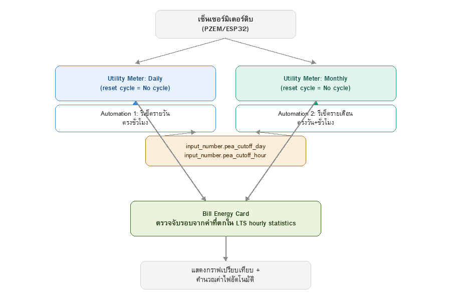
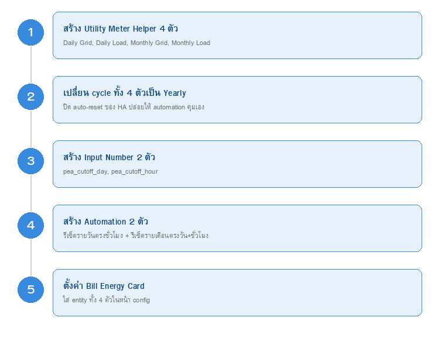

# คู่มือตั้งค่ารอบบิล (Utility Meter + Automation)

วิธีนี้**ไม่ต้องเขียนโค้ด Node-RED** ใช้ Helper ของ Home Assistant ล้วนๆ บวก automation 2 ตัว เพื่อให้ทั้ง **รอบรายวันและรายเดือนตัดตรงชั่วโมงที่กำหนดเหมือนกัน** (รายเดือนตัดตรงวัน+ชั่วโมง, รายวันตัดตรงชั่วโมงทุกวัน) ไม่ใช่แค่เที่ยงคืนแบบ cycle เปล่าๆของ utility_meter

## ภาพรวมระบบ

> ภาพด้านล่างเป็น **diagram ประกอบคำอธิบาย** วาดขึ้นเพื่อให้เห็นภาพรวมการเชื่อมต่อ ไม่ใช่สกรีนช็อตจริงจากหน้า Home Assistant



ทำตามลำดับนี้ **ห้ามสลับขั้นตอน** เพราะ automation ในขั้นที่ 3 ต้องอ้างถึง entity ที่สร้างในขั้นที่ 1-2 ก่อน



ความละเอียดสูงสุดที่ทำได้ด้วยวิธีนี้คือ**ระดับชั่วโมง** (ไม่มีนาที) — ถ้าต้องการละเอียดกว่านี้ต้องเพิ่ม `input_number` สำหรับนาทีและเปลี่ยน automation เป็นเช็คทุก 1 นาทีแทน (ไม่ได้ใช้ในคู่มือนี้)

## ขั้นที่ 1 — สร้าง Utility Meter Helper (4 ตัว) เลือก "No cycle" ตั้งแต่ตอนสร้าง

⚠️ **สำคัญมาก**: Meter reset cycle เลือกได้ครั้งเดียวตอนสร้างเท่านั้น — Home Assistant **ไม่ให้แก้ค่านี้ทีหลัง** (หน้าตั้งค่าหลังสร้างจะให้แก้ได้แค่ input sensor) ถ้าเลือกผิดต้องลบแล้วสร้างใหม่เท่านั้น ดังนั้นเลือกให้ถูกตั้งแต่รอบแรก

Settings → Devices & services → แท็บ **Helpers** → **+ Create helper** → **Utility Meter**

สร้างทีละตัว 4 ตัว โดย **Input sensor** เลือก sensor มิเตอร์ดิบของจริง (ตัวที่ไล่ขึ้นตลอดไม่รีเซ็ตเอง เช่นจาก ESP32/PZEM) และ **Meter reset cycle เลือก "No cycle"** ทุกตัว (ปล่อยให้ automation ในขั้นที่ 3 เป็นคนสั่งรีเซ็ตเองทั้งหมด ไม่ให้ HA auto-reset ซ้อนกัน):

| Name ที่ตั้ง | Input sensor | Meter reset cycle |
|---|---|---|
| Daily Grid | sensor มิเตอร์กริดดิบ | No cycle |
| Daily Load | sensor มิเตอร์โหลดดิบ | No cycle |
| Monthly Grid | sensor มิเตอร์กริดดิบ (ตัวเดิม) | No cycle |
| Monthly Load | sensor มิเตอร์โหลดดิบ (ตัวเดิม) | No cycle |

**วิธีตรวจสอบว่าเลือกถูก**: เปิดดู attribute ของ entity ที่สร้างแล้ว (Developer tools → States) ถ้าเลือก No cycle ถูกต้องจะ**ไม่มี** attribute `next_reset` โผล่มาเลย — ถ้าเห็น `next_reset` เป็นวันที่ในอนาคต (เช่นเที่ยงคืนพรุ่งนี้ หรือวันที่ 1 เดือนหน้า) แปลว่ายังเป็น Daily/Monthly อยู่ ต้องลบแล้วสร้างใหม่

## ขั้นที่ 2 — สร้าง Input Number Helper (2 ตัว)

Settings → Devices & services → Helpers → **+ Create helper** → **Number**

| Name | Entity ID | Min | Max | ค่าเริ่มต้น |
|---|---|---|---|---|
| PEA Cutoff Day | `input_number.pea_cutoff_day` | 1 | 31 | วันที่ตัดรอบจริง (ดูจากใบแจ้งหนี้ PEA) |
| PEA Cutoff Hour | `input_number.pea_cutoff_hour` | 0 | 23 | ชั่วโมงที่ตัดรอบจริง |

`pea_cutoff_hour` ใช้ร่วมกันทั้งรอบรายวันและรายเดือน — แก้ทีเดียวกระทบทั้งคู่

## ขั้นที่ 3 — สร้าง Automation 2 ตัว

Settings → Automations & scenes → **Create Automation** → กด `⋮` มุมขวาบน → **Edit in YAML** → วางทับด้วยอันนี้ (ทำซ้ำ 2 รอบ สร้างคนละตัว):

**Automation 1 — รีเซ็ตรายวัน ตรงชั่วโมงที่กำหนด ทุกวัน**

```yaml
alias: "Reset PEA daily cycle"
trigger:
  - trigger: time_pattern
    minutes: "/5"
condition:
  - condition: template
    value_template: >
      {{ now().hour == states('input_number.pea_cutoff_hour') | int(0)
         and now().minute < 5 }}
action:
  - action: utility_meter.reset
    target:
      entity_id:
        - sensor.smartmeter_2_phase_daily_grid
        - sensor.smartmeter_2_phase_daily_load
```

**Automation 2 — รีเซ็ตรายเดือน ตรงวัน+ชั่วโมงที่กำหนด**

```yaml
alias: "Reset PEA monthly cycle"
trigger:
  - trigger: time_pattern
    minutes: "/5"
condition:
  - condition: template
    value_template: >
      {{ now().day == states('input_number.pea_cutoff_day') | int(0)
         and now().hour == states('input_number.pea_cutoff_hour') | int(0)
         and now().minute < 5 }}
action:
  - action: utility_meter.reset
    target:
      entity_id:
        - sensor.smartmeter_2_phase_monthly_grid
        - sensor.smartmeter_2_phase_monthly_load
```

ทั้งสองตัวเช็คทุก 5 นาที (`minute < 5` กันยิงซ้ำหลายครั้งในชั่วโมงเดียวกัน) — รีเซ็ตจริงอาจคลาดจากเวลาที่ตั้งไว้ได้สูงสุด ~5 นาที

> หมายเหตุ: ถ้าเคยอ่านคู่มือเวอร์ชันก่อนที่บอกให้ใช้ cycle "Yearly" — เปลี่ยนคำแนะนำเป็น **"No cycle"** แล้ว (Yearly ก็ยัง auto-reset เองตอนสิ้นปีอยู่ดี แค่ไกลมาก ส่วน No cycle จะไม่ auto-reset เองเลยตลอดไป ปล่อยให้ automation คุม 100%)

## ขั้นที่ 4 — ตั้งค่า Bill Energy Card

```yaml
type: custom:bill-energy-card
grid_entity_daily: sensor.smartmeter_2_phase_daily_grid
load_entity_daily: sensor.smartmeter_2_phase_daily_load
grid_entity_cycle: sensor.smartmeter_2_phase_monthly_grid
load_entity_cycle: sensor.smartmeter_2_phase_monthly_load
```

## ขั้นที่ 5 (ตัวเลือก) — ผูก input_number เข้ากับการ์ด แก้วัน/ชั่วโมงได้จากในตัวการ์ดเลย

เปิด **แก้ไขการ์ด** → เลื่อนหา section **"การตั้งค่ารอบบิล (ตัวเลือก)"** → เลือก `input_number.pea_cutoff_day` และ `input_number.pea_cutoff_hour` ที่สร้างไว้ในขั้นที่ 2

จากนั้นบนตัวการ์ดจะมีช่อง "วันตัดรอบ" / "ชั่วโมงตัดรอบ" โผล่มาในแถวตั้งค่าด่วน (ข้าง Ft/ค่าบริการ/VAT) แก้แล้วบันทึกจริงเข้า `input_number` ทันที ไม่ต้องเปิด Settings → Helpers อีก

## หมายเหตุ

- ต้องรอให้ **Automation 1** ยิง reset ผ่านไปอย่างน้อย 1 ครั้งก่อน มุมมองรายวันจะมีข้อมูล
- ต้องรอให้ **Automation 2** ยิง reset ผ่านไปอย่างน้อย 1 ครั้งก่อน มุมมองรายเดือนจะมีข้อมูล
- ถ้าจะเปลี่ยนวัน/ชั่วโมงตัดรอบในอนาคต แก้แค่ `input_number.pea_cutoff_day`/`pea_cutoff_hour` จากหน้า UI พอ ไม่ต้องแก้ automation และไม่ต้องลบ/สร้าง utility meter ใหม่ (cycle ไม่ได้ผูกกับวัน/ชั่วโมงพวกนี้ — automation เป็นคนตัดสินใจว่าจะ reset เมื่อไหร่)
- อยากได้ละเอียดถึงระดับนาที: เพิ่ม `input_number.pea_cutoff_minute` (min 0 max 59) แล้วเปลี่ยน trigger ทั้ง 2 automation เป็น `minutes: "/1"` และเปลี่ยนเงื่อนไขจาก `minute < 5` เป็น `minute == states('input_number.pea_cutoff_minute') | int(0)`
